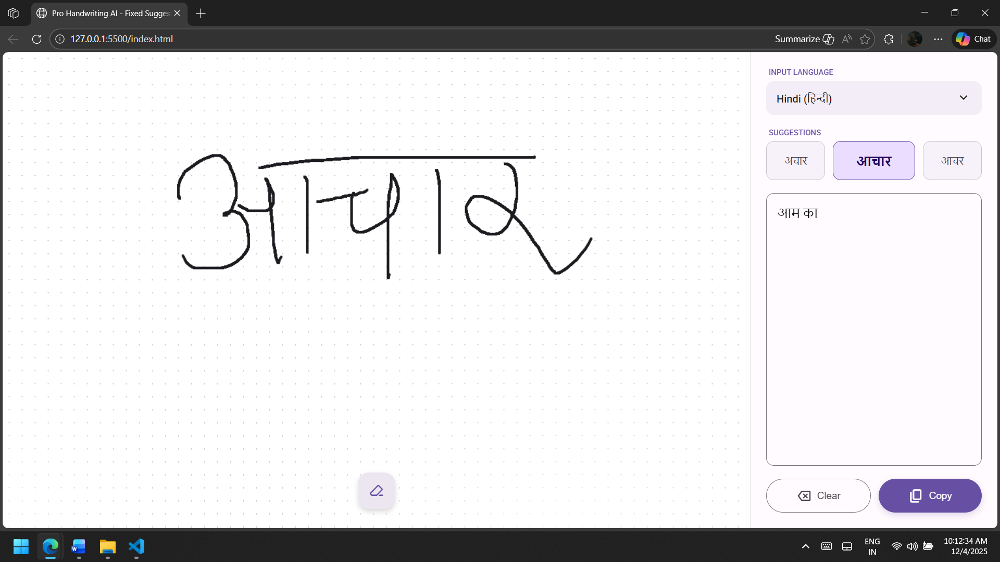

# ✍️ Multilingual Handwriting AI

A beautiful, full-screen web application that converts handwriting into digital text in real-time. Built with **Material 3 Expressive Design**, it supports **20+ languages** including Hindi, English, Greek, Chinese, and more.

  

## 🚀 Live Demo

[**Click here to use the App**](https://Kuldeep-Dilliwar.github.io/Multilingual-Handwriting-AI/)

## ✨ Features

*   **Real-time Recognition:** Instantly converts strokes to text using Google's Input Tools API.
*   **Zero Latency:** Immediate processing upon lifting the mouse/finger (no input lag).
*   **Material 3 UI:** Modern, "Expressive" design using the Violet/Purple tonal palette.
*   **Smart Layout:**
    *   **Fixed Sidebar:** The interface never jumps or shrinks while you write.
    *   **3-Card Suggestions:** Displays the Top 3 results in a static grid (Left, Center-Highlighted, Right).
*   **Cross-Platform:**
    *   **Desktop:** Full-screen whiteboard experience.
    *   **Mobile:** Responsive vertical layout for writing on the go.
*   **Searchable Language List:** Easily find your language with a built-in search bar.
*   **Utility Tools:** One-click "Copy to Clipboard" and "Clear Text" functions.

## 🌍 Supported Languages

Supports over 20 languages, including but not limited to:
*   Hindi (हिन्दी)
*   English
*   Greek (Ελληνικά)
*   Chinese (中文)
*   Japanese (日本語)
*   Russian (Русский)
*   Arabic (العربية)
*   Spanish, French, German, Italian, Portuguese
*   Bengali, Marathi, Tamil, Telugu, Kannada, Malayalam, Punjabi, Urdu, Nepali

## 🛠️ How to Run Locally

This project is built as a **Single Page Application (SPA)** with zero dependencies. You do not need Node.js, React, or Python to run it.

1.  Clone the repository:
    ```bash
    git clone github.com:Kuldeep-Dilliwar/Multilingual-Handwriting-AI.git
    ```
2.  Navigate to the folder.
3.  Double-click `index.html` to open it in your browser.

**Note:** An internet connection is required for the handwriting recognition to work (it connects to Google's API).

## 🧩 How it Works

1.  **Canvas API:** Captures mouse and touch coordinates (X, Y, Time) as "Strokes".
2.  **Fetch API:** Sends these stroke arrays to the Google Input Tools endpoint (`inputtools.google.com`).
3.  **JSON Processing:** Parses the response and extracts the top 3 predicted words.
4.  **DOM Manipulation:** Updates the suggestion cards and text area dynamically.

## ⚠️ API Disclaimer

This project utilizes the undocumented public API endpoints used by Google Input Tools.
*   **No API Key required.**
*   **Free for personal and educational use.**
*   Data is processed by Google's servers. Do not use for highly sensitive/confidential data.

## 📸 Screenshots



## 📄 License

This project is open source and available under the [MIT License](LICENSE).

---

<p align="center">
  Made with ❤️ by [Kuldeep Dilliwars]
</p>